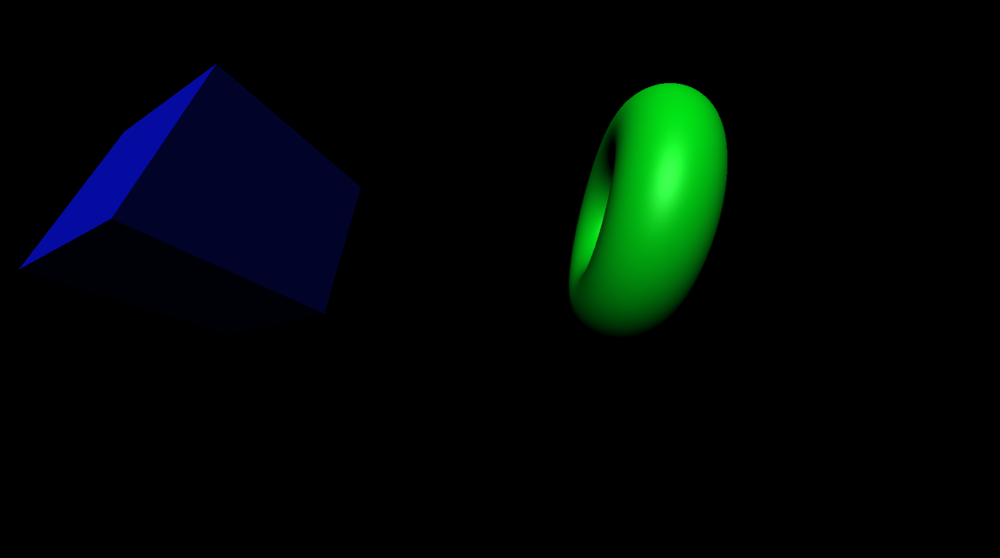

# Project description

I deided to try the Three.js library and it was fantastic. I really liked how you can incorporate 3D objects into a website. It is pretty hard to create something complicated, therefore I decided to stick to simple fundametals. I created two geometry objects that spin around - A Cube and a Donut shaped object. I also decided to make the website resizable as well as the objects. To create something special, I decide to play with camera position and made it follow the cursor of the user.

### What have I learned

It was a fun experience to learn something new, however, due to limited time and the complicated system of Three.js, it is hard to create a better work. I believe that with a training it could be used to create beautiful parallax effects and make even your portfolio beautiful. 

I learned: 
<ul> 
    <li> The basics of Three.js, the camera movements and scene management</li>
    <li> Geometrical objects of Three js and how to make them move constantly</li>
    <li> How to resize the window and make the scene also resize as well as mouse interactions</li>
</ul>