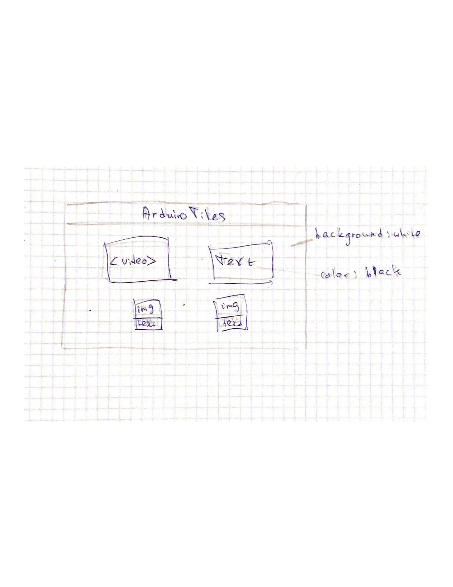

# Website about Arduino Tiles project

This porject was made in 2020, July as a final project for "Introduction to Interactive Media" class. The project is a game that has a two-way connection with Arduino and Processing and the game mechanics are as in the Piano Tiles game. I decided to go with this project, since I have a video and some photos from the production period. I decided to go minimalistic with everything on one page, since there is nothing much to talk about this project. I also added some  that are from 'iconify' library. This exercise wasn't rea;;y hard, but omre of a refreshing experience to rememer all the HTML tags, CSS and so on. I had a problem on how to embed a video from YouTube, but the problem was in my inattentiveness, so it worked after a quick look in Google. You can see the website <a href="https://61f712d1290c89a93e304f82--frosty-nightingale-b14b21.netlify.app/"> here </a>
  
  
 Here is the wireframe of the website:
  

 
  
